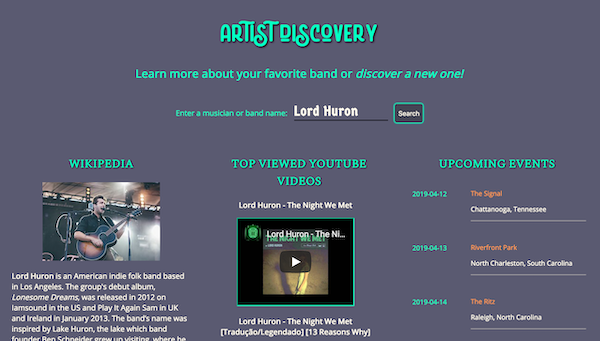

# ARTIST DISCOVERY


## ABOUT
ARTIST DISCOVERY is an app that allows the user to search for a band or musician name, then pulls from 3 APIs (Wikipedia, Youtube, and Ticketmaster). The user will then be able to see an extract from the artist's Wikipedia page, their top 5 played YouTube videos, and any upcoming event dates
ARTIST DISCOVERY provides the user with a simple hub to see relevant information about their favorite band all in one place. Or they can search for an artist they may not know much about, and get back a lot of information!


## SCREENSHOTS
Search Page:


Results Page:




## LINK TO LIVE APP

[Demo](https://jenngonzalez.github.io/Artist-Discovery-API/)


## TECH USED
```
HTML/CSS/JavaScript/jQuery
APIs from Wikipedia, YouTube, and Ticketmaster
```
